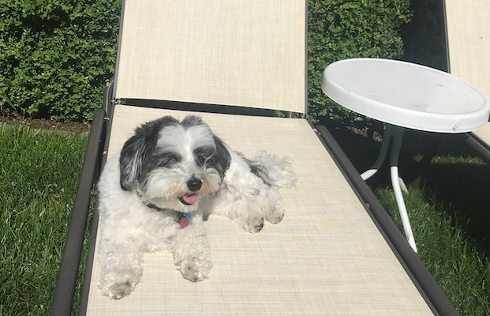
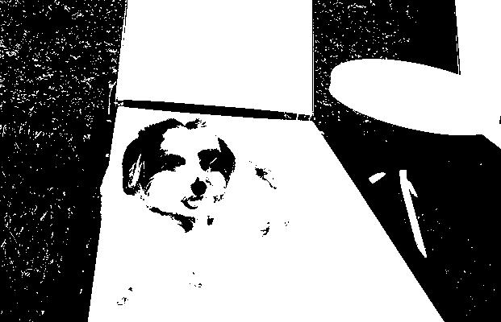
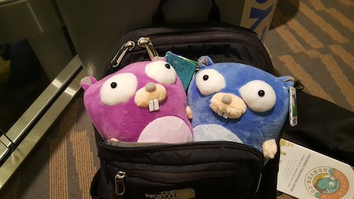
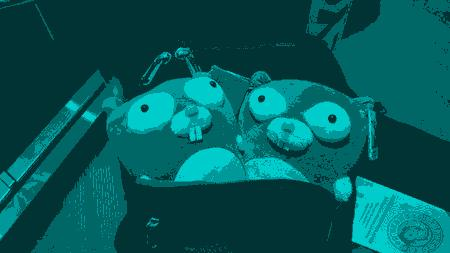

# Go luminance filter

## Overview

An image filter you can apply to photos. You give the program a picture and tell it which [luminance](https://en.wikipedia.org/wiki/Relative_luminance) (brightness) ranges to convert to which colors, and it recolors them. Use it to make logos for stuff like personal branding, or as a fun photo filter!

For an example usage if we run the script on this picture to recolor every pixel brighter than 50% luminance to white, and every pixel darker than 50% luminance to black

We would get this picture

## Usage

`go-luminance-filter <original-image-path> [-o output filepath] [-t luminance thresholds]`

* `-o,--output` - Indicates which filepath to output the recolored image to. Default is `recolored.jpg`.

* `-t,--thresholds` - Comma-separated thresholds indicating which color to recolor each luminance range to, following the pattern `{luminancePercent1},{color1},{luminancePercent2},{color2},...` where luminance percents are whole numbers from 0-100, and colors are represented as hexadecimal RGB values. One of the luminance thresholds MUST be zero. Default `0,000000,50,FFFFFF`

When the program runs, it gets the luminance percent of each pixel and then recolors that pixel to the color paired with the **highest** luminance percent that that pixel is brighter than. For example if we have the `-t` argument `0,000000,50,FFFFFF,75,FF00FF`, then any pixel above 75% luminance would be recolored to violet (#FF00FF), any pixel with a luminance between 50% and 75% would be recolored to white (#FFFFFF), and any pixel below 50% luminance would be recolored to black (#000000).

While the default is just two thresholds, you can use this filter with as many as you want as long as there are no duplicates, and one of the thresholds is for 0% luminance. If you run

`go-luminance-filter ~/Downloads/gophers.jpg -t 0,003333,25,006666,50,009999,75,00CCCC -o aqua-gophers.jpg`

on this this picture:

it will be converted to different shades of aqua:

